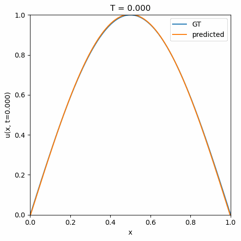

### Respository for PINN experiments using PyTorch.

Suppose we must solve a 1D heat equation:

$\frac{\partial u}{\partial t} = 0.4 \frac{\partial^2 u}{\partial x^2}$, $x \in [0, 1]$, $t \in [0, 1]$

with initial conditions:

$u(0, t) = u(1, t) = 0$

$u(x, 0) = sin(\pi x)$

The exact solution is:

$u(x, t) = e^{-0.4 \pi^2 t} sin(\pi x)$.

The same solution, generated by training a simple MLP, can be seen in the GIF below:

